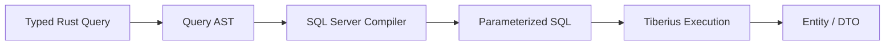
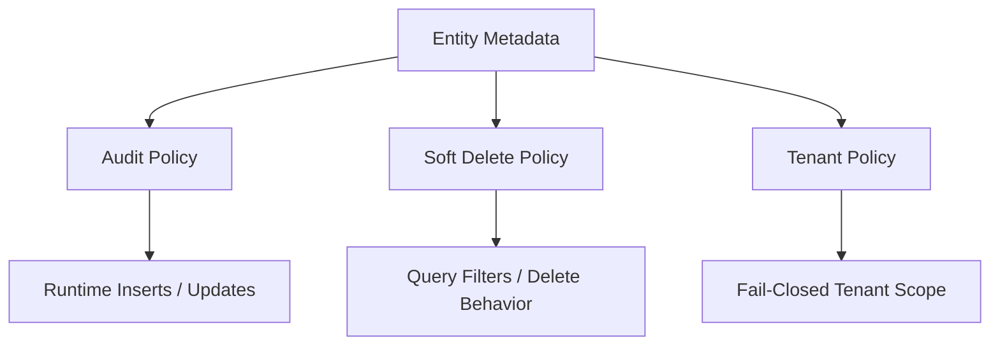
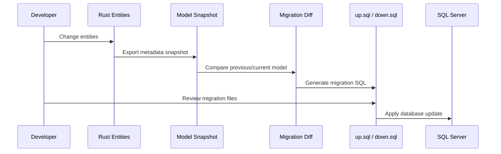
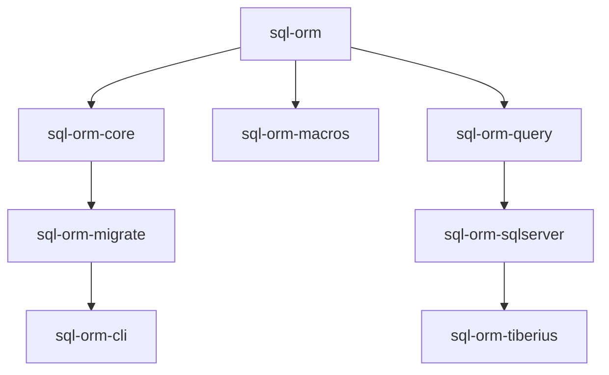

# sql-orm

<p align="center">
  <strong>A code-first ORM for Rust and Microsoft SQL Server</strong>
</p>

<p align="center">
  Typed models · Query builder · Migrations · Relationships · Transactions · SQL Server-first design
</p>

<p align="center">
  
  
  
  <a href="https://crates.io/crates/sql-orm"></a>
  <a href="https://docs.rs/sql-orm"></a>
  <a href="https://crates.io/crates/sql-orm"></a>
</p>

---

## What is `sql-orm`?

`sql-orm` is a code-first ORM for Rust applications that use Microsoft SQL Server.

It lets you define your database model using Rust structs, derive metadata from those structs, build typed queries, generate SQL Server-specific SQL, run migrations, and execute everything through Tiberius.

```text
Rust structs
    ↓
Entity metadata
    ↓
Query AST
    ↓
SQL Server SQL
    ↓
Tiberius
    ↓
Entity / DTO
```

The goal is to keep application code strongly typed, expressive, and close to your domain while still producing real parameterized SQL Server SQL.

---

## Table of Contents

- [Highlights](#highlights)
- [When Should You Use It?](#when-should-you-use-it)
- [Installation](#installation)
- [Published Crates](#published-crates)
- [Quick Example](#quick-example)
- [Query Builder](#query-builder)
- [DTO Projections](#dto-projections)
- [Relationships](#relationships)
- [Entity Policies](#entity-policies)
- [Raw SQL](#raw-sql)
- [Migrations](#migrations)
- [Architecture](#architecture)
- [Current Limits](#current-limits)
- [Documentation](#documentation)
- [Local Validation](#local-validation)

---

## Highlights

| Feature | Description |
|---|---|
| Code-first models | Rust structs define database metadata, schema snapshots, and migrations |
| SQL Server-first | Designed specifically for SQL Server syntax, parameters, DDL, and `rowversion` |
| Typed queries | Build filters, ordering, pagination, joins, includes, and projections safely |
| Derive-based API | Use `Entity`, `Insertable`, `Changeset`, `DbContext`, and `FromRow` |
| Safe raw SQL | Execute manual SQL using parameters and typed result mapping |
| Migrations | Generate reviewable SQL from Rust metadata snapshots |
| Entity policies | Declare audit, soft delete, and tenant behavior from model metadata |
| Layered design | Clear separation between metadata, AST, SQL generation, execution, and migrations |

---

## When Should You Use It?

Use `sql-orm` if you want:

- A Rust-first development experience for SQL Server.
- Code-first schema metadata.
- Typed query construction instead of scattered SQL strings.
- SQL Server-specific behavior instead of a generic multi-database abstraction.
- A clean public API over Tiberius.
- Reviewable migrations generated from model snapshots.

> [!NOTE]
> SQL Server is currently the only supported backend.

> [!WARNING]
> This project is still `0.1.0`. Some APIs are experimental or intentionally limited. See [Current Limits](#current-limits).

---

## Installation

Use the public root crate from crates.io:

```toml
[dependencies]
sql-orm = "0.1.0"
```

With optional `bb8` pooling support:

```toml
[dependencies]
sql-orm = { version = "0.1.0", features = ["pool-bb8"] }
```

Import the prelude:

```rust
use sql_orm::prelude::*;
```

Install the migration CLI from crates.io when you need migration commands:

```bash
cargo install sql-orm-cli
```

<details>
<summary>What does the prelude include?</summary>

The prelude exposes the normal user-facing API:

- Public derives
- `DbContext`
- `DbSet`
- Query extensions
- Error types
- Metadata contracts
- Common SQL values
- Mapping traits

</details>

---

## Published Crates

All workspace crates are published on crates.io. Application code should normally depend only on `sql-orm`; the other crates are documented for advanced use and architecture visibility.

| Crate | crates.io | API docs | Purpose |
|---|---|---|---|
| `sql-orm` | [package](https://crates.io/crates/sql-orm) | [docs](https://docs.rs/sql-orm) | Public facade for applications |
| `sql-orm-cli` | [package](https://crates.io/crates/sql-orm-cli) | [docs](https://docs.rs/sql-orm-cli) | Migration and database commands |
| `sql-orm-core` | [package](https://crates.io/crates/sql-orm-core) | [docs](https://docs.rs/sql-orm-core) | Contracts, metadata, SQL values, errors, and neutral rows |
| `sql-orm-macros` | [package](https://crates.io/crates/sql-orm-macros) | [docs](https://docs.rs/sql-orm-macros) | Derives and metadata generation |
| `sql-orm-query` | [package](https://crates.io/crates/sql-orm-query) | [docs](https://docs.rs/sql-orm-query) | Query AST and query-builder primitives |
| `sql-orm-sqlserver` | [package](https://crates.io/crates/sql-orm-sqlserver) | [docs](https://docs.rs/sql-orm-sqlserver) | SQL Server query and DDL compilation |
| `sql-orm-tiberius` | [package](https://crates.io/crates/sql-orm-tiberius) | [docs](https://docs.rs/sql-orm-tiberius) | Connections, execution, transactions, rows, and pooling |
| `sql-orm-migrate` | [package](https://crates.io/crates/sql-orm-migrate) | [docs](https://docs.rs/sql-orm-migrate) | Snapshots, diffs, operations, and migration helpers |

---

## Quick Example

### 1. Define an entity

```rust
use sql_orm::prelude::*;

#[derive(Entity, Debug, Clone)]
#[orm(table = "users", schema = "dbo")]
pub struct User {
    #[orm(primary_key)]
    #[orm(identity)]
    pub id: i64,

    #[orm(length = 180)]
    #[orm(unique)]
    pub email: String,

    #[orm(length = 120)]
    pub name: String,
}
```

### 2. Define write models

```rust
#[derive(Insertable)]
#[orm(entity = User)]
pub struct NewUser {
    pub email: String,
    pub name: String,
}

#[derive(Changeset)]
#[orm(entity = User)]
pub struct UpdateUser {
    pub email: Option<String>,
    pub name: Option<String>,
}
```

### 3. Define a context

```rust
#[derive(DbContext)]
pub struct AppDb {
    pub users: DbSet<User>,
}
```

### 4. Insert, find, update, and delete

```rust
let db = AppDb::connect(connection_string).await?;

let saved = db
    .users
    .insert(NewUser {
        email: "ana@example.com".to_string(),
        name: "Ana".to_string(),
    })
    .await?;

let found = db.users.find(saved.id).await?;

let updated = db
    .users
    .update(
        saved.id,
        UpdateUser {
            email: None,
            name: Some("Ana Perez".to_string()),
        },
    )
    .await?;

let deleted = db.users.delete(saved.id).await?;
```

<details>
<summary>What happens behind the scenes?</summary>

The ORM reads the generated entity metadata, builds the SQL Server statement, binds parameters safely, executes it through Tiberius, and materializes the result back into your Rust type.

</details>

---

## Query Builder

Generated columns are typed query symbols.

```rust
let active_users = db
    .users
    .query()
    .filter(User::active.eq(true).and(User::email.contains("@example.com")))
    .order_by(User::email.asc())
    .take(20)
    .all()
    .await?;
```

The query builder produces a neutral AST. SQL Server SQL is generated only by `sql-orm-sqlserver`.



---

## DTO Projections

Use DTO projections when you do not need full entities.

```rust
use sql_orm::prelude::*;

#[derive(Debug, FromRow)]
struct UserSummary {
    id: i64,

    #[orm(column = "email_address")]
    email: String,
}

let summaries = db
    .users
    .query()
    .select((
        User::id,
        SelectProjection::expr_as(
            sql_orm::query::Expr::from(User::email),
            "email_address",
        ),
    ))
    .all_as::<UserSummary>()
    .await?;
```

<details>
<summary>Projection support</summary>

DTO projections can use:

- Entity columns
- Aliased expressions
- Explicit joins
- Selected subsets of columns
- Custom `FromRow` mappings

</details>

---

## Relationships

Relationships are explicit and metadata-driven.

```rust
use sql_orm::prelude::*;

#[derive(Entity, Debug, Clone)]
#[orm(table = "users", schema = "dbo")]
pub struct User {
    #[orm(primary_key)]
    pub id: i64,

    pub email: String,

    #[orm(has_many(Post, foreign_key = user_id))]
    pub posts: Collection<Post>,
}

#[derive(Entity, Debug, Clone)]
#[orm(table = "posts", schema = "dbo")]
pub struct Post {
    #[orm(primary_key)]
    pub id: i64,

    #[orm(foreign_key(entity = User, column = id))]
    pub user_id: i64,

    pub title: String,

    #[orm(belongs_to(User, foreign_key = user_id))]
    pub user: Navigation<User>,
}
```

Include a related entity:

```rust
let posts = db
    .posts
    .query()
    .include::<User>("user")?
    .all()
    .await?;

let author = posts[0].user.as_ref();
```

Include a collection:

```rust
let users = db
    .users
    .query()
    .include_many_as::<Post>("posts", "posts")?
    .max_joined_rows(2_000)
    .all()
    .await?;

let posts = users[0].posts.as_slice();
```

> [!IMPORTANT]
> Navigation fields do not trigger hidden database I/O when accessed. Lazy wrappers represent loaded or not-loaded state, but they do not store context or execute SQL by themselves.

---

## Entity Policies

Entity policies let you declare cross-cutting behavior from metadata.



### Auditing

```rust
use chrono::{DateTime, Utc};
use sql_orm::prelude::*;

#[derive(AuditFields)]
pub struct Audit {
    #[orm(created_at)]
    #[orm(default_sql = "SYSUTCDATETIME()")]
    pub created_at: DateTime<Utc>,

    #[orm(created_by)]
    #[orm(length = 120)]
    pub created_by: String,

    #[orm(updated_at)]
    pub updated_at: DateTime<Utc>,

    #[orm(updated_by)]
    #[orm(length = 120)]
    pub updated_by: String,
}

#[derive(Entity)]
#[orm(table = "todos", schema = "todo", audit = Audit)]
pub struct Todo {
    #[orm(primary_key)]
    #[orm(identity)]
    pub id: i64,

    pub title: String,
}
```

Audit columns are part of schema metadata. They do not need to appear as fields on the entity itself.

### Soft Delete

`#[orm(soft_delete = SoftDelete)]` converts public delete operations into logical-delete updates.

Normal queries hide deleted rows by default.

### Tenant Scoping

`#[orm(tenant = CurrentTenant)]` enables fail-closed tenant filters for opt-in entities.

Reads and writes on the root entity apply tenant scoping automatically.

> [!CAUTION]
> Raw SQL and manual joins require explicit tenant and visibility predicates.

---

## Raw SQL

Use raw SQL when the query builder does not model the statement you need yet.

```rust
let rows = db
    .raw::<UserSummary>(
        "SELECT id, email AS email_address FROM dbo.users WHERE email LIKE @P1",
    )
    .param("%@example.com")
    .all()
    .await?;
```

Execute a command:

```rust
let result = db
    .raw_exec("UPDATE dbo.users SET active = @P1 WHERE id = @P2")
    .params((false, 7_i64))
    .execute()
    .await?;
```

| API | Purpose |
|---|---|
| `raw<T>()` | Query rows and map them into a typed result |
| `raw_exec()` | Execute commands such as `UPDATE`, `DELETE`, or custom SQL |
| `.param(...)` | Bind a single parameter |
| `.params(...)` | Bind multiple parameters |

---

## Migrations

The migration flow is based on snapshots and reviewable SQL.



Create a migration:

```bash
sql-orm-cli migration add CreateUsers \
  --manifest-path path/to/Cargo.toml \
  --snapshot-bin model_snapshot
```

Apply pending migrations:

```bash
sql-orm-cli database update --execute \
  --connection-string "$DATABASE_URL"
```

Generate a downgrade script to keep a known target migration applied:

```bash
sql-orm-cli database downgrade --target <MigrationId> > database_downgrade.sql
```

Execute that same rollback flow directly:

```bash
sql-orm-cli database downgrade --target <MigrationId> --execute \
  --connection-string "$DATABASE_URL"
```

Use `--target 0` only when you explicitly want to roll back all local
migrations. Downgrade requires local `up.sql` for checksum validation and an
executable `down.sql` for every migration being rolled back; it does not infer
reverse SQL from snapshots.

Generated artifacts:

| File | Purpose |
|---|---|
| `up.sql` | SQL applied when migrating forward |
| `down.sql` | SQL used by `database downgrade` for reviewed or executed rollback |
| `model_snapshot.json` | Captured model metadata after the migration |

> [!NOTE]
> `migration.rs` is not part of the current MVP.

---

## Transactions and Pooling

`db.transaction(...)` is available on contexts created from a direct connection.

With the optional `pool-bb8` feature, `db.transaction(...)` is also supported
for contexts created from `from_pool(...)`. The runtime checks out one physical
pooled SQL Server connection, pins it for the full closure, runs `BEGIN`,
`COMMIT` or `ROLLBACK` on that same connection, and then returns it to the
pool. Runtime tenant, audit, soft-delete and tracking state stay on the shared
context handle, and `save_changes()` reuses the active transaction instead of
opening a nested one.

<details>
<summary>Operational features</summary>

The Tiberius layer exposes configuration for:

- Timeouts
- Retry
- Tracing
- Slow-query logging
- Health checks
- Optional pooling

</details>

---

## Architecture

The workspace is split by responsibility.

| Crate | Responsibility |
|---|---|
| [`sql-orm-core`](https://docs.rs/sql-orm-core) | Contracts, metadata, SQL values, errors, and neutral rows |
| [`sql-orm-macros`](https://docs.rs/sql-orm-macros) | Derives and metadata generation |
| [`sql-orm-query`](https://docs.rs/sql-orm-query) | Query AST and query-builder primitives |
| [`sql-orm-sqlserver`](https://docs.rs/sql-orm-sqlserver) | SQL Server query and DDL compilation |
| [`sql-orm-tiberius`](https://docs.rs/sql-orm-tiberius) | Connections, execution, transactions, rows, and pooling |
| [`sql-orm-migrate`](https://docs.rs/sql-orm-migrate) | Snapshots, diffs, operations, and migration helpers |
| [`sql-orm-cli`](https://docs.rs/sql-orm-cli) | Migration and database commands |
| [`sql-orm`](https://docs.rs/sql-orm) | Public facade for applications |



This separation keeps each layer focused:

```text
core      -> contracts and metadata
query     -> AST only
sqlserver -> SQL generation
tiberius  -> execution
migrate   -> schema evolution
sql-orm -> public API
```

---

## Current Limits

See [docs/stability-audit.md](docs/stability-audit.md) for the updated stability boundaries.

| Area | Current status |
|---|---|
| Backend support | SQL Server only |
| `Tracked<T>` | Stable for explicit single-primary-key tracking |
| `save_changes()` | Stable for explicit single-primary-key tracking |
| Composite primary keys | Metadata exists, public persistence support is limited |
| Tracking ownership | Pending `Added`, `Modified`, and `Deleted` work is registry-owned after wrapper drop/consume; detached loaded identities can reattach to registry snapshots; one live tracked handle per persisted identity is allowed per context |
| Relationship graph persistence | Not implemented; persist dependents or explicit join entities directly |
| Many-to-many navigation | Use an explicit join entity |
| Lazy loading | No automatic I/O from field access |
| `include_many(...).split_query()` | API exists, execution returns not implemented |
| Raw SQL filters | Tenant and soft-delete filters must be written manually |
| `database downgrade` | Available through explicit `--target`; requires local checksums and executable `down.sql` |
| `migration.rs` | Deferred |
| Pooled transactions | Supported with `pool-bb8`; one physical connection is pinned for the closure |

---

## Documentation

| Resource | Description |
|---|---|
| [Published API docs](https://docs.rs/sql-orm) | Rustdoc for the root public crate |
| [crates.io package](https://crates.io/crates/sql-orm) | Published package metadata and install snippet |
| [CLI package](https://crates.io/crates/sql-orm-cli) | Installable migration and database command-line tool |
| [Core concepts](docs/core-concepts.md) | Repository guide for the mental model and end-to-end flow |
| [Quickstart](docs/quickstart.md) | Repository guide for connection, CRUD, and query builder |
| [Code-first guide](docs/code-first.md) | Repository guide for entities, derives, `DbContext`, and metadata |
| [Public API](docs/api.md) | Repository guide for the public surface exported from the root crate |
| [Query builder](docs/query-builder.md) | Repository guide for filters, ordering, pagination, joins, includes, and projections |
| [Navigation properties](docs/navigation.md) | Repository guide for `belongs_to`, `has_one`, `has_many`, includes, and limits |
| [Typed projections](docs/projections.md) | Repository guide for `select(...)`, `all_as::<T>()`, aliases, and DTOs |
| [Typed raw SQL](docs/raw-sql.md) | Repository guide for `raw<T>()`, `raw_exec()`, parameters, and security |
| [Relationships](docs/relationships.md) | Repository guide for foreign keys, joins, navigation, and loading |
| [Transactions](docs/transactions.md) | Repository guide for runtime behavior and pooled transactions |
| [Migrations](docs/migrations.md) | Repository guide for snapshots, diffs, `migration add`, `database update`, and `database downgrade` |
| [Entity policies](docs/entity-policies.md) | Repository guide for audit, soft delete, tenant, and limits |
| [Tracking stability](docs/tracking-stability.md) | Repository guide for stabilization criteria for tracking APIs |
| [Use from another project](docs/use-without-downloading.md) | Repository guide for using the published crates |

---

## Examples

- [Examples overview](examples/README.md)
- [Todo app example](examples/todo-app/README.md)

> [!NOTE]
> Last real SQL Server validation for the `todo-app` smoke flow was run on
> 2026-05-17 against local `tempdb` with `DATABASE_URL`: fixture setup, ignored
> smoke test, HTTP read endpoints and migration script apply all passed. Rerun
> the integration tests and smoke flow before treating a future release
> candidate as freshly validated.

---

## Local Validation

Run standard checks:

```bash
cargo fmt --all --check
cargo check --workspace
cargo test --workspace
cargo clippy --workspace --all-targets --all-features
```

Tests against a real SQL Server instance require:

```bash
export SQL_ORM_TEST_CONNECTION_STRING="Server=localhost;Database=tempdb;User Id=sa;Password=Password123;TrustServerCertificate=True;Encrypt=False"
```

---

## Project Documents

- [Contributing](CONTRIBUTING.md)
- [Security](SECURITY.md)
- [License](LICENSE)
